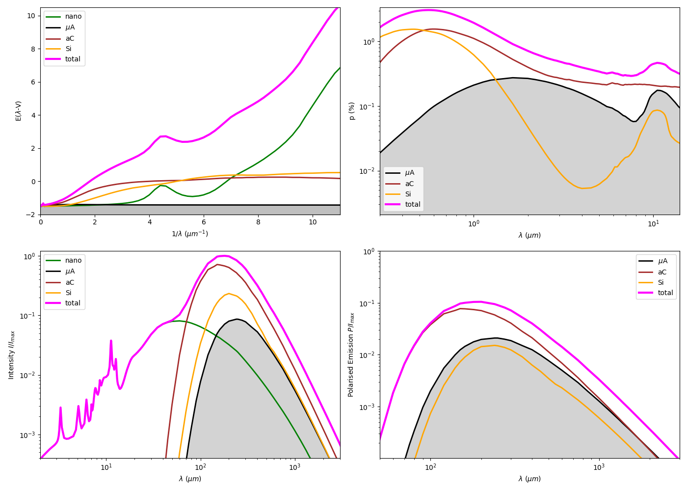

# dark_dust_pol
Code for computing extinction, optical polarization, and total and polarized emission from dust.
----------------------------------------------------------------------
jsmDDpol
----------------------------------------------------------------------

jsmDDpol computes dust extinction, optical polarization, total and
polarized emission for the three-component dust model described in
Siebenmorgen R. 2023, A&A, 670, A115

Dust is heated either by the interstellar radiation field (ISRF;
Mathis et al. 1983) or by a star/AGN in an optically thin environment.

The relative masses of the dust components are derived from the input
abundances. Dust cross-sections (cm^2/g ISM dust) for absorption and
scattering are computed in the subroutine sigtDark_AvEbvPol using grain
efficiencies Q. The Q values depend on

  - optical constants of the material
  - axial ratio a/b (prolate grains)
  - porosity
  - magnetic field orientation Omega

The corresponding Q files are provided via the Q-file library of dust 
cross-sections of spheroidal particles available at:
https://zenodo.org/uploads/19185782

----------------------------------------------------------------------
Compilation
----------------------------------------------------------------------

  gfortran -ffixed-line-length-132 -O3 jsmDDpol.f sigtDark_AvEbvPol.f -o a.j

----------------------------------------------------------------------
Dust model
----------------------------------------------------------------------

1) Nano-particles: vGr, PAH, vSi

   - Graphite (vGr) and PAH: 2175 AA bump, far-UV reddening,
     IR bands and continuum
   - Nano-silicates (vSi): far-UV and MIR contribution

2) Amorphous grains: aC and aSi

   - Radii: 6 nm to approximately 260 nm (MRN-type distribution)
   - Prolate shape
   - Optical constants:
       aSi: Demyk et al. (2023)
       aC : Zubko (1996)

3) Micron-sized aggregates (Dark Dust, DD)

   - Radii: 260 nm to approximately 3 micron
   - Dominate polarization in the NIR and submm
   - Abundance constrained via luminosity and trigonometric
     distance estimates of stars (Siebenmorgen et al. 2025, ApJ 979, L45)

Alignment:

  - RAT alignment for a > arad_polmin
  - Smaller grains are randomly oriented
  - Si grains assumed perfectly aligned
  - aC grains: 50 percent paramagnetic, otherwise unaligned

----------------------------------------------------------------------
Input (./Input/)
----------------------------------------------------------------------

- jsmDDpol.inp

    Dust parameters for reddening fits (with or without nano-particles):
      * size distribution parameters
      * min/max radii of aC, aSi, DD
      * minimum alignment radius
      * abundances of aC, aSi, DD, vGr, vSi, PAH
      * PAH size (number of C atoms), cluster size, H/C ratio
      * radiation field (ISRF scaling or other option)
      * E(B-V) and maximum polarization (e.g. from Serkowski fit)

- Wavelength grid file (e.g. w12_vv2_Ralf_283wave.dat)

- d.Q* files

    Grain efficiencies for each component.
    Default example:
      a/b = 2, porosity = 10 percent, Omega = 60 deg

    For other configurations, copy appropriate files from the
    Q-file library of dust cross-sections of spheroidal particles available at:
    https://zenodo.org/uploads/19185782

 

----------------------------------------------------------------------
Output (./Output/)
----------------------------------------------------------------------

- Kappa.out

    Absorption and scattering cross-sections converted to optical
    depth via column densities (see Eq. 11 in S26).

- PolKappa.out

    Polarization cross-sections for aC, aSi, and DD.

- tau4fit.out

    Extinction and reddening curves (normalized and absolute).

Dust cross-sections are given in cm^2/g dust. Abundances may be
specified relative rather than absolute, since scaling all abundances
by a common factor leaves the reddening curve unchanged.

----------------------------------------------------------------------
Example:
----------------------------------------------------------------------
- Example_RedPolEmis.pdf
- For reproduction of this pdf file run /a.j and use idl istart

----------------------------------------------------------------------
Author
----------------------------------------------------------------------

Ralf Siebenmorgen
European Southern Observatory (ESO)

For questions or issues, please contact:
RalfSiebenmorgen@eso.org
----------------------------------------------------------------------
